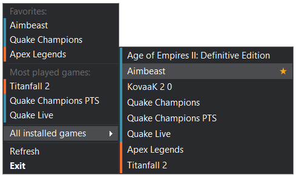

**Disclaimer**: currently, this project is in the early alpha version with a *minimal set of features* and (sometimes) *not very stable work*.

DotLauncher is a minimalist aggregator of popular game launchers allowing to start any installed game in two clicks through the tray icon menu:

The main idea of DotLauncher was born due to removal "Universal Game Launcher" Discord feature ([blog post](https://blog.discord.com/were-constantly-listening-to-your-feedback-and-working-to-improve-how-discord-feels-and-functions-676a5cb3ab63)) and out of desire to replace it with some non-complex 3rd-party utility. 

# Features

* Automatic generation of a list with installed games (currently Steam, Origin and Epic libraries are supported)
* The ability to launch any game in two clicks
* Smart list of the most played games
* Adding games to the favorites list

# Installation and usage

No installation required. Just [download](https://github.com/kochetkov/DotLauncher/releases) the archive, unpack it to any convenient place on your disk and run the executable file.
